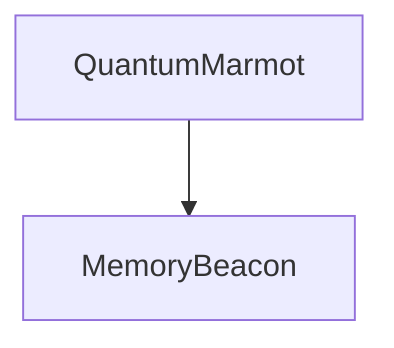

# Full App QA Report — 2026-06-13

## Scope

Playwright QA pass across the main user workflow and major routes:

1. Sign up / authenticated entry.
2. Create a new markdown note.
3. Verify auto-save and persistence after reload.
4. Verify the note syncs into the knowledge graph, including Mermaid diagram nodes/edges.
5. Ask Chat a question about the new note.
6. Confirm answer correctness and latency.
7. Smoke test `/graph`, `/skills`, `/experimental/wiki`, `/maintenance`, and `/help`.

## Environment

- App server: `npm run dev -- --host 127.0.0.1 --port 5177`
- Data dir: isolated temp data directory.
- Browser automation: Playwright Chromium.
- Local Ollama availability: `http://localhost:11434/api/tags` was not reachable before QA.
- To complete the chat latency/correctness workflow deterministically, QA used a local mock Ollama-compatible server on `localhost:11434` implementing:
  - `GET /api/tags`
  - `POST /api/embed`
  - `POST /api/chat`

> Important: Chat QA validated the app's chat/query/RAG UI plumbing and notes+graph evidence flow. It did not validate the quality of a real local model because Ollama was unavailable in this environment.

## Test note used

```md
# QA Graph Memory Note

The Quantum Marmot project uses Memory Beacon for graph recall.


```

## Results summary

| Area | Result |
|---|---:|
| Sign up | Pass |
| New note creation | Pass |
| Auto-save status | Pass |
| Persistence after reload | Pass |
| Knowledge graph sync | Pass |
| Mermaid node/edge extraction | Pass |
| Chat answer correctness | Pass with mocked Ollama |
| Chat latency | Pass, ~797 ms with mocked Ollama |
| `/graph` smoke | Pass |
| `/skills` smoke | Pass |
| `/experimental/wiki` smoke | Pass |
| `/maintenance` smoke | Pass |
| `/help` smoke | Pass |

## Verified workflow evidence

### New note saved

Screenshot: [qa-note-saved.png](./screenshots/qa-note-saved.png)

Observed:
- Note title updated to `QA Graph Memory Note`.
- Status bar reached `SAVED`.
- Reload preserved the note.

### Knowledge graph sync

Screenshot: [qa-graph-page.png](./screenshots/qa-graph-page.png)

Authenticated `/api/graph` contained:
- entity: `QA Graph Memory Note`
- Mermaid diagram entity: `QuantumMarmot`
- Mermaid diagram entity: `MemoryBeacon`
- relation: `QuantumMarmot --depends_on--> MemoryBeacon`
- relation provenance method: `diagram`

### Chat answer

Screenshot: [qa-chat-answer.png](./screenshots/qa-chat-answer.png)

Question:

> What does Quantum Marmot use for graph recall?

Observed answer included:

> Quantum Marmot uses Memory Beacon for graph recall...

Latency: ~797 ms with mocked Ollama.

## Bugs found

### QA-001 — Empty homepage still exposes ingestion/wiki admin workflow

Severity: Medium

Screenshot: [bug-qa-001-homepage-wiki-panels.png](./screenshots/bug-qa-001-homepage-wiki-panels.png)

Fresh note-first homepage still shows:
- `LLM WIKI SOURCES`
- source import controls
- latest ingest review panel

Why this matters:
- The pivot plan says wiki/raw-source/ingest workflows should not be on the main homepage or primary workflow.
- This makes the first-run experience still feel like an ingestion admin console instead of a notes app.

Suggested fix:
- Remove `SourcesPane` and `IngestReviewPanel` from the default empty homepage.
- Move them to `/maintenance` or `/experimental/wiki`.
- Replace with recent files, quick create note, graph insights, skill candidates, and chat entry point.

---

### QA-002 — Primary Chat navigation does not open Chat

Severity: Medium

Screenshot: [bug-qa-002-chat-nav-not-functional.png](./screenshots/bug-qa-002-chat-nav-not-functional.png)

Observed:
- Primary nav contains a `Chat` link.
- Clicking it navigates/stays at `/` but does not open the chat panel.

Why this matters:
- Chat is listed as a primary navigation item, so users expect it to open Chat.
- Current behavior appears broken or inert.

Suggested fix options:
1. Add a real `/chat` route.
2. Or change the nav item to a button that sets `chatOpen = true`.
3. Or support `/?chat=1` and have the homepage open Chat based on query params.

---

### QA-003 — Chat renders object coverage as `Wiki coverage: [object Object]`

Severity: Medium

Screenshot: [qa-chat-answer.png](./screenshots/qa-chat-answer.png)

Observed in the assistant response metadata area:

```txt
Wiki coverage: [object Object]
```

Why this matters:
- The new note-memory pipeline returns structured coverage:

```ts
{
  noteCount: number;
  graphEdgeCount: number;
  hasEvidence: boolean;
}
```

- `ChatPanel.svelte` still assumes the old wiki coverage shape of `'strong' | 'weak'`.
- It also labels the section `Wiki coverage` even when default retrieval is notes+graph.

Suggested fix:
- Add a normalized chat coverage display model:
  - wiki mode: `Wiki coverage: strong/weak`
  - notes+graph mode: `Memory evidence: X notes · Y graph edges`
- Update `Message.coverage` type and tests.
- Hide `FileAnswerPanel` unless citations are wiki/raw-source citations.

---

### QA-004 — Login page emits protected API 401 in browser console

Severity: Low

Screenshot: not applicable; browser console/network observation.

Observed:

```txt
Failed to load resource: the server responded with a status of 401 (Unauthorized)
```

This occurred during login/signup flow before authentication completed.

Likely cause:
- Root layout health-check logic runs on the login page and calls an authenticated API endpoint before a session exists.

Suggested fix:
- Skip Ollama health checks while `isLoginPage` is true.
- Or make the health endpoint public if it is safe to expose.

## Overall QA conclusion

The core notes → save → graph → chat workflow is functioning under mocked-Ollama conditions:

- New notes save successfully.
- Notes persist across reloads.
- Mermaid diagram nodes and edges sync into graph API output.
- Chat can answer from the note/graph memory path quickly when an Ollama-compatible backend responds.

Main product issues remaining are UX/navigation polish and legacy wiki surface area on the homepage, plus adapting ChatPanel display logic to the new notes+graph coverage object.
