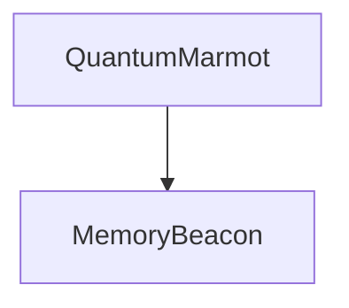

# Full App QA Report — Real Ollama Pass — 2026-06-13

## Scope

Redo of the full Playwright QA pass with the user's real `ollama serve` instance. No mock Ollama server was used.

Validated workflow:

1. Sign up.
2. Create a new markdown note.
3. Confirm the note saves successfully.
4. Reload and confirm persistence.
5. Confirm note and Mermaid diagram sync into the knowledge graph.
6. Ask Chat a question about that note.
7. Confirm answer correctness, insightfulness, and latency.
8. Smoke test major routes.

## Environment

- App: `npm run dev -- --host 127.0.0.1 --port 5178`
- Data dir: isolated temp directory `/tmp/mdnotes-qa-real/data`
- Browser: Playwright Chromium
- Ollama: real local `ollama serve` at `http://localhost:11434`
- Models detected included:
  - `llama3.2:3b`
  - `nomic-embed-text:latest`
  - others
- App default chat model: `llama3.2:3b`
- App embedding model path: `nomic-embed-text`

## Test note

```md
# QA Graph Memory Note

The Quantum Marmot project uses Memory Beacon for graph recall.


```

## Results summary

| Area | Result |
|---|---:|
| Signup | Pass |
| New note creation | Pass |
| Save status reached `SAVED` | Pass |
| Persistence after reload | Pass |
| Graph API contains note entity | Pass |
| Graph API contains Mermaid nodes | Pass |
| Graph API contains Mermaid edge | Pass |
| `/graph` route smoke | Pass |
| Chat answer correctness | Pass |
| Chat answer insightfulness | Pass |
| Chat answer latency target, “few seconds” | Fail — ~22.98s |
| `/skills` route smoke | Pass |
| `/experimental/wiki` route smoke | Pass |
| `/maintenance` route smoke | Pass |
| `/help` route smoke | Pass |

## Verified evidence

### New note saved

Screenshot: [qa-note-saved.png](./real-ollama-screenshots/qa-note-saved.png)

Observed:

- Note title became `QA Graph Memory Note`.
- Status bar reached `SAVED`.
- Reload preserved the note.

### Knowledge graph sync

Screenshot: [qa-graph-page.png](./real-ollama-screenshots/qa-graph-page.png)

Authenticated `/api/graph` contained:

- entity: `QA Graph Memory Note`
- Mermaid diagram node entity: `QuantumMarmot`
- Mermaid diagram node entity: `MemoryBeacon`
- relation: `QuantumMarmot --depends_on--> MemoryBeacon`
- relation provenance method: `diagram`

### Chat answer with real Ollama

Screenshot: [bug-qa-005-chat-answer.png](./real-ollama-screenshots/bug-qa-005-chat-answer.png)

Question:

> What does Quantum Marmot use for graph recall?

Observed answer:

> Quantum Marmot uses Memory Beacon for graph recall, as shown in the graph depicted above (Note: QA Graph Memory Note).
>
> In other words, Memory Beacon is the component used by Quantum Marmot to perform graph recall.

Assessment:

- Correct: yes.
- Insightful enough: yes; it cites the note and restates the graph relation.
- Delivered in a few seconds: no.
- Measured latency: ~22,977 ms.

## Bugs found

### QA-001 — Empty homepage still exposes ingestion/wiki admin workflow

Severity: Medium

Screenshot: [bug-qa-001-homepage-wiki-panels.png](./real-ollama-screenshots/bug-qa-001-homepage-wiki-panels.png)

Observed on a fresh account homepage:

- `LLM WIKI SOURCES`
- source import controls
- latest ingest review panel

Why this matters:

- The pivot plan says wiki/source/ingest workflows should be moved out of the main homepage and primary user flow.
- The first-run product still feels partly like an ingestion admin console instead of a notes app.

Suggested fix:

- Remove `SourcesPane` and `IngestReviewPanel` from the homepage empty state.
- Move them under `/maintenance` or `/experimental/wiki`.
- Replace with note-first content: recent files, quick create note, graph insights, skill candidates, and chat entry.

---

### QA-002 — Primary Chat navigation does not open Chat

Severity: Medium

Screenshot: [bug-qa-002-chat-nav-not-functional.png](./real-ollama-screenshots/bug-qa-002-chat-nav-not-functional.png)

Observed:

- Primary nav includes `Chat`.
- Clicking `Chat` leaves the user on `/` and does not open the Chat panel.

Why this matters:

- Chat is a primary navigation item but behaves like a no-op.

Suggested fix options:

1. Add a real `/chat` route.
2. Or make the nav item a button that sets `chatOpen = true`.
3. Or support `/?chat=1` and auto-open Chat from the homepage.

---

### QA-003 — Chat displays notes+graph coverage as `Wiki coverage: [object Object]`

Severity: Medium

Screenshot: [bug-qa-005-chat-answer.png](./real-ollama-screenshots/bug-qa-005-chat-answer.png)

Observed below the assistant answer:

```txt
Wiki coverage: [object Object]
```

Why this matters:

- Default chat retrieval is now notes+graph, not wiki-first.
- The query API returns structured coverage for note memory:

```ts
{
  noteCount: number;
  graphEdgeCount: number;
  hasEvidence: boolean;
}
```

- `ChatPanel.svelte` still treats coverage like the older wiki string state.

Suggested fix:

- Normalize coverage display:
  - notes+graph mode: `Memory evidence: 1 note · 2 graph edges`
  - experimental wiki mode: `Wiki coverage: strong/weak`
- Update `Message.coverage` typing and tests.

---

### QA-004 — Login/signup emits a protected API 401 in browser console

Severity: Low

Screenshot: not applicable; browser console/network observation.

Observed during signup:

```txt
Failed to load resource: the server responded with a status of 401 (Unauthorized)
```

Likely cause:

- App layout or startup health checks call an authenticated API before login completes.

Suggested fix:

- Skip protected app health checks on `/login`.
- Or make health endpoints public if safe.

---

### QA-005 — Chat answer is correct but too slow with real Ollama

Severity: High

Screenshot: [bug-qa-005-chat-answer.png](./real-ollama-screenshots/bug-qa-005-chat-answer.png)

Observed:

- Chat answer was correct and grounded.
- Delivery took ~22.98 seconds, which fails the requested “few seconds” target.

Why this matters:

- The intended UX is fast memory recall.
- The current path likely does too much synchronous work before/while answering:
  - semantic embedding/search over notes
  - graph snapshot/rebuild work
  - full prompt assembly
  - real local model latency

Suggested fixes:

1. Cache note chunks and embeddings after save instead of embedding during query.
2. Cache graph snapshots and update incrementally on note save.
3. Use a smaller/faster default chat model when available, or expose a “fast recall model” setting.
4. Stream partial answer tokens into the UI instead of waiting for the full response.
5. Add timing instrumentation for retrieval, embedding, graph expansion, and model generation.

## Overall QA conclusion

With real Ollama running, the core workflow succeeds functionally:

- New note saves.
- Note persists.
- Mermaid diagram entities and edges sync into the graph.
- Chat answers correctly from the note/graph memory.

However, the workflow does not meet the “few seconds” responsiveness target with the real local model in this environment. The highest-priority fixes are:

1. Speed up or cache retrieval/embedding/graph work.
2. Stream chat output.
3. Fix ChatPanel coverage rendering for notes+graph mode.
4. Remove wiki/ingest panels from the default homepage.
5. Make the primary Chat nav functional.
